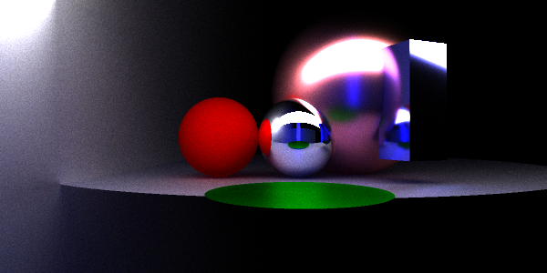
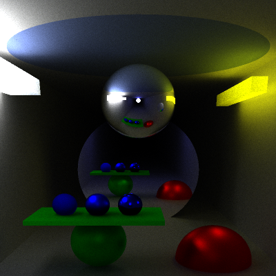

SIMPLE-PT
=========

This is a none-optimized path tracer for practicing and testing various optimization techniques.

## Examples:

## Supported geometry:

* plane
* disk
* sphere
* oriented bounding box

## Building:

Run `genie vs2015` at this directory, then checkout project files at `.build` directory

Or, checkout pre-generated project files for vs2015 at [vs2015](vs2015)

## BRDF:

* GGX model

## Usage:

    simple-pt (-? | --help)
    simple-pt --version
    simple-pt <scene> [--width=<w>] [--height=<h>] [--depth=<d>] [--samples=<n>] [--algo=fast|--algo=trace] [--output=<fn>]

Options:

    -?, --help           show this help
    --version            show version
    -w X, --width=X      image width  [default: 320]
    -h Y, --height=Y     image height [default: 200]
    -d depth, --depth=d  tracing depth (bounce times) [default: 6]
    -s n, --samples=n    number of samples per pixel [default: 512]
    -a f, --algo=f       rendering function, fast or trace [default: trace]
    -o f, --output=f     output file name [default: output.ppm]

To re-generate example images, use:

    $ simple-pt test/scene.xml -s 2048 -w 600 -h 300 -d 32 -o scene.ppm
    $ simple-pt test/room.xml -s 2048 -w 400 -h 400 -d 32 -o room.ppm

## Scene Description:

see [test](test) folder for examples
